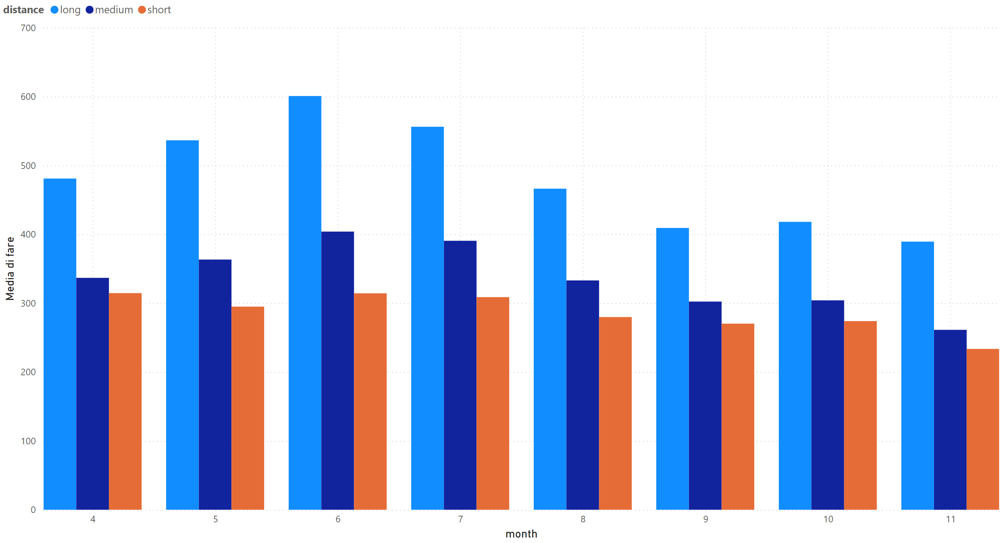
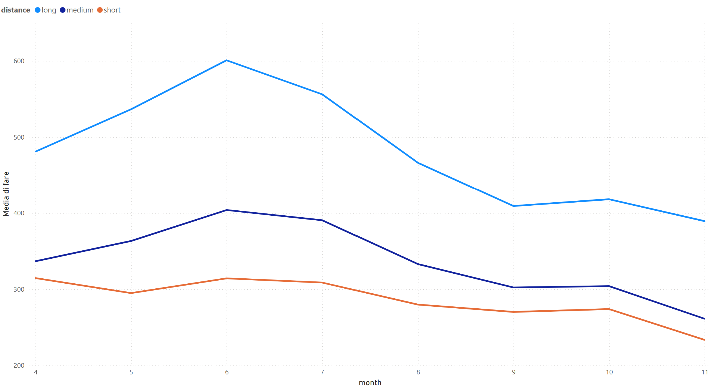

# Reports

Per rappresentare graficamente i dati estratti dal *job* e facilitare l'analisi e la comprensione dei risultati
ottenuti, è stato utilizzato lo strumento **[Power BI Desktop](https://apps.microsoft.com/detail/9NTXR16HNW1T?hl=it-it&gl=IT&ocid=pdpshare)**.
I risultati ottenuti con il *sample* 33 sono contenuti nel file: [results.pbix](results.pbix).

## Rappresentazione dei risultati

Dai risultati sono stati generati due grafici che mostrano la variazione della media del prezzo (`fare`) nei diversi
mesi (`month`) dell'unico anno disponibile, in relazione alla distanza percorsa (`distance`).

Il primo grafico è un diagramma a barre che consente di confrontare direttamente i valori medi delle tariffe per ciascun
mese, distinguendo tra distanze corte, medie e lunghe.

Il secondo grafico rappresenta gli stessi dati, ma attraverso un grafico a linee, facilitando l'osservazione delle 
tendenze e delle eventuali fluttuazioni stagionali.

## Analisi dei risultati

L’analisi dei grafici suggerisce che:

- le tariffe per le tratte lunghe sono mediamente più alte rispetto a quelle per distanze medie e corte;
- nei mesi estivi si nota un aumento dei prezzi, specialmente per le tratte lunghe, seguita da una
  riduzione nei mesi successivi;
- la variazione dei prezzi risulta più marcata per le tratte lunghe rispetto a quelle brevi, suggerendo che le tariffe per le distanze più corte siano meno soggette a oscillazioni stagionali.

## Conclusioni

L’analisi condotta conferma l’ipotesi di una variazione stagionale delle tariffe, con una correlazione tra il mese
dell’anno e l’andamento dei prezzi. In particolare, i mesi estivi mostrano un incremento significativo delle tariffe,
mentre negli altri mesi si registra una stabilizzazione o una leggera diminuzione.